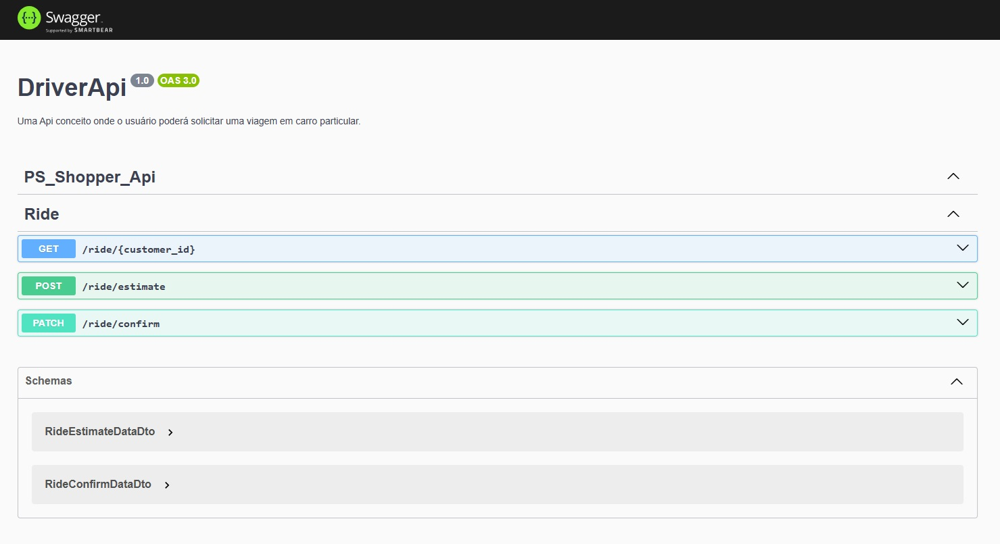
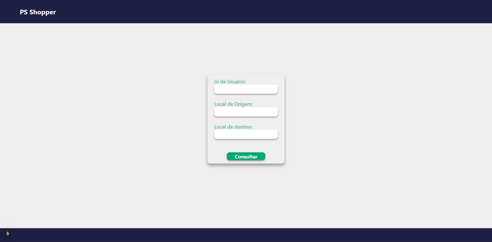

# Project Driver-App

#### This project is a simple app that simulates a driver app interface in addition with its api. It was developed using NestJs, Prisma ORM, Postgres, Zod Validation, Swagger, Typescript, Docker, NextJs and TailwindCss.

## Requirements

⚠️ You'll need to have Docker and Docker Compose installed in your machine. ⚠️

## Running the project

### First you need to clone the project on you preferable directory using the following command:

`git clone git@github.com:arturMucci/driver.git`

### Second you need to create a `.env` file in the root of the project with the following variables:

#### GOOGLE_API_KEY

The google api key generated in the google cloud platform, you can generate one by following the instructions in the following link: https://developers.google.com/maps/gmp-get-started. It must have the format of a string of characters.

#### POSTGRES_USER

The user that will be used to connect to the postgres database. It must have the format of a string of characters.

#### POSTGRES_PASSWORD

The password that will be used to connect to the postgres database. It must have the format of a string of characters.

#### POSTGRES_DB

The name of the database that will be used in the postgres database. It must have the format of a string of characters.

#### POSTGRES_HOST

The host that will be used to connect to the postgres database. It must have the format of a string of characters, in this case defaults to the name of the db container (postgres).

#### POSTGRES_PORT

The port that will be used to connect to the postgres database. It must have the format of a number.

#### API_PORT

The port that will be used to run the api. It must have the format of a number.

#### APP_PORT

The port that will be used to run the app. It must have the format of a number.

#### VITE_PORT

The port that will be used to run the app. It must have the format of a number.

#### DATABASE_URL

The url that will be used to connect to the postgres database. It must have the following format:

#### `postgresql://<POSTGRES_USER>:<POSTGRES_PASSWORD>@<POSTGRES_HOST>:<POSTGRES_PORT>/<POSTGRES_DB>?schema=public`

### Linux

#### Open the terminal and run the following command:

`docker-compose up -d`

## Stopping the project

### Linux

#### Open the terminal and run the following command:

`docker-compose up -d`

## Swagger


To access the swagger documentation, you can access the following link: http://localhost:8080/swagger

## App Inteface


To access the app interface, you can access the following link: http://localhost

### The interface has four elements:

- userId (Id de Usuário) - Is a text input field, you must enter the id of the user that will be used to simulate the driver app. Must be a string of characters, could contain letters numbers or special characters.

- origin (Local de Origem) - Is a text input field, you must enter the origin of the trip. Must be a string of characters, could be an address, a city name, a lat long coordinate, anything that the google maps api can interpret as a origin.

- destination (Local de Destino) - Is as text input field, you must enter the destination of the trip. Exactly like the origin, must be a string of characters, could be an address, a city name, a lat long coordinate, anything that the google maps api can interpret as a destination.

- button (Consultar) - When you click on the submit button, the app will send a request to the api to create a trip with the data entered in the fields above.

```

```
